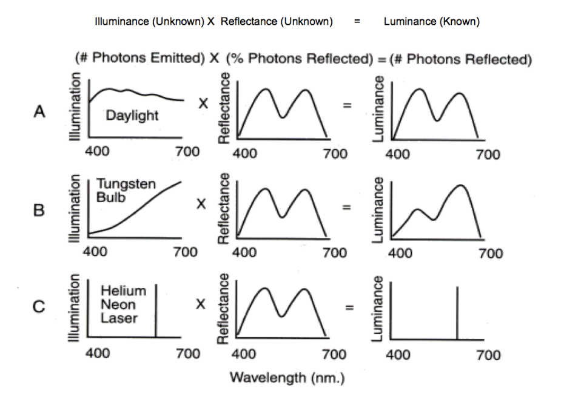

## Computational Perception Highlights

### Attention Window

We have a limited 30x30 attention window where if we want to look at someething bigger, the quality of the object decreases

### How we view colors

Although we see the luminance, our brain corrects for what it believes is the illumninance to learn the object's true reflectance color