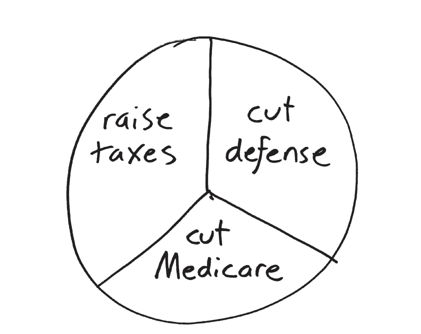

# How Not to be Wrong Excerpt: Public Opinion Doesn't Exist

- If we ask: should we cut spending or raise taxes? Then cut spending wins.
- If we ask: should we cut medicare? 2/3 will say no.

The majority rules system seems fair and simple, but it really doesn't make sense when deciding between more than 2 options

## Look at Obamacare

In an October 2010 poll of likely voters, 52% of respondents said they opposed Obamacare, while only 41% supported it. Bad news for Obama? Not once you break down the numbers.

- Outright repeal of the Obamacare reform was favored by 37%
- 10% said the law should be weakened
- 15% preferred to leave it as is
- 36% said Obamacare should be expanded to change the current health care system more than it currently does

This suggests that many of the law’s opponents are to Obama’s left, not his right (36% said it should be expanded although 37%+10% think the policy is too far left).

Which of these news headlines are true:

1. Majority of Americans oppose Obamacare!
2. Majority of Americans want to preserve or strengthen Obamacare!

## Looking at a Real Election

In Burlington, Vermont (also Australia) they use a different voting system (instant runoff voting)

1. where you mark off your preferences in order (not just picking a single candidate).
2. Start by counting the first-place votes, and eliminate the candidate who got the fewest. 
3. Then, using the new preferences count the remaining votes and decide the winner

| Vote                   | Count |
| ---------------------- | ----- |
| Montroll, Kiss, Wright | 1332  |
| Montroll, Wright, Kiss | 767   |
| Montroll               | 455   |
| Kiss, Montroll, Wright | 2043  |
| Kiss, Wright, Montroll | 371   |
| Kiss                   | 568   |
| Wright, Montroll, Kiss | 1513  |
| Wright, Kiss, Montroll | 495   |
| Wright                 | 1289  |

- Wright, the Republican, gets 3297 first-place votes in all
- Kiss (democrat) gets 2982
- Montroll (democrat) gets 2554. 

This city in Vermont is pretty liberal, but if they followed the conventional voting scheme Wright the republican would have won.

What happened:

1. Montroll, the Democrat, had the fewest first-place votes, so he was eliminated. 
2. Recounted vote: Kiss 4314, Wright 4064, and Kiss is reelected.

What's wrong?

- You can check that 4067 voters liked Montroll better than Kiss
  - 3477 liked Kiss better than Montroll.
- 4597 voters preferred Montroll to Wright
  - only 3668 preferred Wright to Montroll

In other words, a majority of voters liked the centrist candidate Montroll better than Kiss but a centrist is very unlikely to win in this setup

### Interesting Take Away

- Traditional American voting method: Wright wins 
- Instant-runoff method: Kiss wins
- Head-to-head matchups: Montroll wins

### Now Think About This

- Suppose those 495 voters who wrote “Wright, Kiss, Montroll” had decided to vote for Kiss instead, leaving the other two candidates off their ballot
- And let’s say 300 of the Wright-only voters switch to Kiss too

1. Wright now has 2502 first place votes so he gets eliminated instead of Montroll
2. The election then goes down to Montroll vs. Kiss, and Montroll wins, 4067–3777

Basically if we give Kiss more votes, he will end up losing the election.