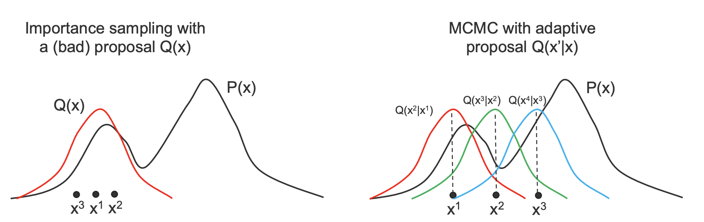
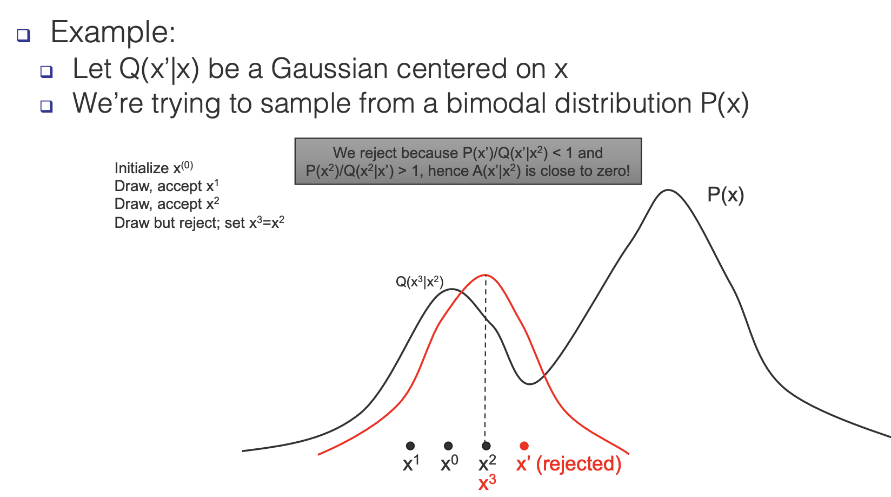

# Markov Chain Monte Carlo

Monte Carlo methods are algorithms that:

- Generate samples from a given probability distribution $p(x)$
- Estimate expectations of functions $\mathbb{E}[f(x)]$ under the distribution $p(x)$

## Intro

Suppose we want to sample points from a distribution $\Pi(x) = \Pi'(x)/Z$ (where $Z$ is a normalization constant) that is difficult to sample from, but $\Pi'(x)$ is easy to evaluate.

- We can sample from a simpler distribution $Q(x)$ and just reject a sample that is very unlike the distribution.

- In fact, if we accept a new point $x^* \sim Q(x)$ with probability $\Pi^{\prime}\left(x^{*}\right) / k Q\left(x^{*}\right)$ then the probability of sampling a certain $x$ is actually equivalent to sampling from $\Pi(x)$ as shown below:
  $$
  p(x) =\frac{\left[\Pi^{\prime}(x) / k Q(x) | Q(x)\right.}{\int\left[\Pi^{\prime}(x) / k Q(x) | Q(x) d x\right.} =\frac{\Pi^{\prime}(x)}{\int \Pi^{\prime}(x) d x}=\Pi(x)
  $$

However, it can take a very long time to sample using this method because the rejection rate of sampled points will be incredibly high (especially as the dimensionality of the data increases).

## Metropolis Hastings

We can solve this using an adaptive proposal distribution of $Q(x'|x)$ instead of $Q(x')$ (where $x'$ is the new state being sampled and $x$ is the previous sample).

### The Algorithm

1. Draw a sample $x'$ from $Q(x'|x)$
2. The new sample is accepted with probability $A(x'|x) = min(1, \frac{P(x')Q(x|x')}{P(x)Q(x'|x)})$
3. If the new sample is accepted then draw this sample and set x = x' otherwise leave $x$ as is
4. Repeat

- Usually the algotihm has a "burn in" phase where it runs for a while without us actually recording. any samples since in the beginning the samples have "not converged" to the true probability.

This algorithm will speed up the convergence to the true distribution.

