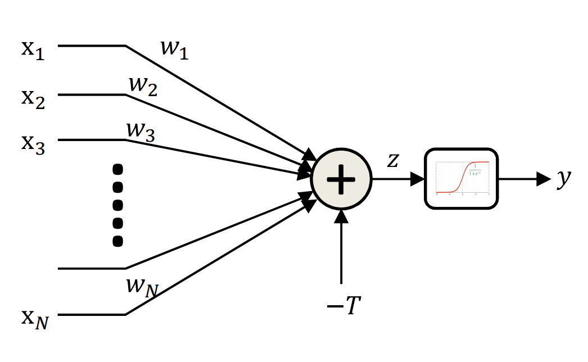
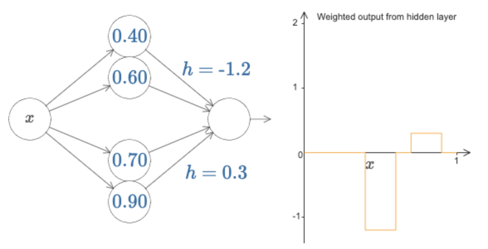

# Neural Network as Universal Approximator

### Conventional Neural Network

<a href="../search_pics/NeuralNetUniversalApprox/lec2.universal.pdf">11785 Lecture link</a>

### Example of Neural Network learning boxes to replicate a function

